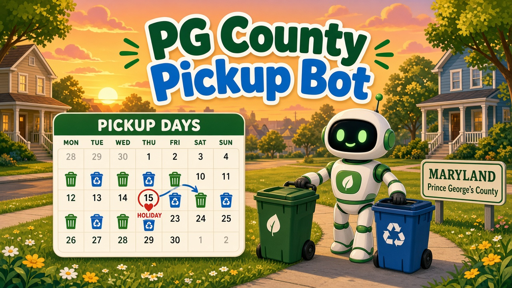

# PG County Pickup Bot



A family near Clinton, in Prince George's County, Maryland, can keep trash, recycling, yard-trim, and bulky-pickup days on a calendar, including the county's holiday shifts.

The public repo does not contain a home address. Weekdays can come from the county's public ArcGIS layer, or from a YAML schedule you edit. Holiday slides for 2026, and New Year's Day 2027, are a curated table in [`src/pgpickup/data/holidays.yaml`](src/pgpickup/data/holidays.yaml). Sources and the date they were checked are in [`docs/SOURCES.md`](docs/SOURCES.md).

## Install

Python 3.11 or newer.

```bash
python -m venv .venv
source .venv/bin/activate
pip install -e '.[dev]'
cp config.example.yaml config.yaml
```

`config.yaml` is gitignored. Put the household address only there, or in the `PGPICKUP_ADDRESS` environment variable.

Optional Google Calendar libraries:

```bash
pip install -e '.[google]'
```

## Configure

`config.example.yaml` is an offline example: Thursday trash and recycling, Monday yard trim, bulky trash with the trash. It is not a real household. `address` is null.

```yaml
source: manual          # or lookup
reminder_time: "19:00"  # local time the evening before
timezone: America/New_York
include_location: false
schedule:
  trash:
    weekdays: [thursday]
  recycling:
    weekdays: [thursday]
    frequency: weekly     # or alternate, which also needs anchor: YYYY-MM-DD
  yard_waste:
    weekdays: [monday]
    season: null          # county default is year-round; set MM-DD start/end to limit it
  bulky:
    mode: with_trash      # with_trash, weekdays, appointment, or none
```

`source: lookup` ignores the weekday lists and fills them from the county layer. Recycling frequency, the yard-waste season, and an explicit bulky mode still come from the config. The layer stores a weekday, not an every-other-week flag, so the default is weekly.

Holiday edits belong in the YAML table. `observe: slide` moves Monday–Friday regular days on or after the holiday one day later (Friday lands on Saturday). `observe: none` means the county still collects. `observe: skip` drops only that date.

## Commands

```bash
pgpickup lookup --address '1301 McCormick Drive, Largo, MD 20774'
pgpickup schedule
pgpickup next
pgpickup ics --out pickups.ics
pgpickup push
```

`lookup` geocodes the address and queries the county Trash Services layer. The address above is the county administration building printed on the department's contact page, not a house. On 2026-10-06 that point was inside the layer and marked `No Service`. Add `--save` to write the returned weekdays into gitignored `config.yaml`. A repeat lookup uses the cache and does not call the county again. `--refresh` bypasses the cache and still makes only one geocode request and one map query.

`schedule` prints the weekly pattern and the next shifted dates. `next` prints the next pickups. `ics` writes a calendar for the configured range (past dates in that range are included, so a year can be imported).

Import `pickups.ics` into Google Calendar, Apple Calendar, or any other RFC 5545 client, or subscribe to a copy you host yourself. Events use `America/New_York`. The default reminder is 7:00 p.m. Eastern the evening before, which is after the county's 6:00 p.m. set-out time. The event itself runs 6:00 a.m. to 8:00 p.m., the county's published collection window. The street address is omitted unless `include_location: true`.

### Google Calendar

Off unless `google_calendar.enabled` is true. `pgpickup push` is a dry run and does not call Google. Writing also requires `dry_run: false` and `pgpickup push --apply`.

Put your own OAuth client JSON at the gitignored path in the config (`secrets/` is ignored). The requested scope is `https://www.googleapis.com/auth/calendar.events` only. Events use the same UID as the ICS file (`stream-YYYY-MM-DD@pgcounty-pickup-bot.local`, based on the regular weekday, not the shifted day). A second push updates those events instead of creating duplicates. The program never deletes a calendar event.

### GitHub Pages

[`.github/workflows/publish-ics.yml`](.github/workflows/publish-ics.yml) is off. The weekly cron is commented out, and the job does not run unless the repository variable `PGPICKUP_PUBLISH_ENABLED` is `true`. The address has to be the `PGPICKUP_ADDRESS` secret. The workflow deletes its temporary config and refuses to publish an `.ics` file that contains that address.

## Tests

```bash
ruff check src tests
ruff format --check src tests
pytest
```

## Limitations

- County schedules change. Confirm the day with [the county](https://www.princegeorgescountymd.gov/departments-offices/environment/waste-recycling/trash-recycling) or [PGC311](https://www.pgc311.com/) before you rely on a reminder.
- Holiday shifts are copied from an HTML page, not from an API. The rest of 2027 was not published when the table was checked on 2026-10-06. `pgpickup schedule` warns when the date range runs past the table.
- The Thanksgiving heading on the county page does not match the table body, and Independence Day 2026 (a Saturday) does not slide Friday, July 3 in the dated table. Details are in `docs/SOURCES.md` and the YAML notes.
- Some municipalities are not on the county route. The sample county building returns `No Service`.
- The lookup layer has one trash day field. A second trash day, if you have one, has to be added by hand.
- Yard trim is year-round on the county's residential page. The season window in the config is there for an area whose rules differ. It does nothing when `season` is null.
- Curbside bulky means up to four items on collection day. Appliances, scrap tires, electronics, and scrap metal need a PGC311 appointment and are not booked by this program.
- Weather delays are not in the feed.
- `www.princegeorgescountymd.gov/robots.txt` returned HTTP 403 on the day the pages were read, so no crawl rules could be checked. The program does not scrape that site.
